Dashboard Sistem Pengelolaan Barang & Laporan ArrasyNET Berbasis Web
(Tugas Mata Kuliah Rekayasa Perangkat Lunak)
================================================
## Nama : Ramadhan Ardi Iman Prakoso
## NIM : 312210722
## Kelas : TI. 22. A3
Tugas Pertemuan 8 - 12 - 13

Membuat dashboard sistem untuk membantu pemilik dan petugas dalam melakukan proses pengelolaan dan laporan yang terdiri dari 2 web yaitu:

- Web untuk Petugas
- Web untuk Pemilik

### Teknologi yang digunakan:

MySQL

### Library yang digunakan:

Bootstrap (CoolAdmin admin dashboard template)

### Software tool:

Visual Studio Code, Xampp

### Bahasa:

PHP, CSS, HTML, JavaScript

### Fitur:

Web Petugas & Pemilik:

- Login
- Register
- Dashboard
- Data Harga
- Data Pelanggan
- Data Transaksi
- Laporan Perbulan
- Laporan Pertahun
- Tambah Data Pelanggan Baru
- Search Data
- Print
- Profile
- Logout
- Dashboard Pemilik (hanya dapat melihat dan mencetak data/laporan)

# Preview

### Screenshot

### Login

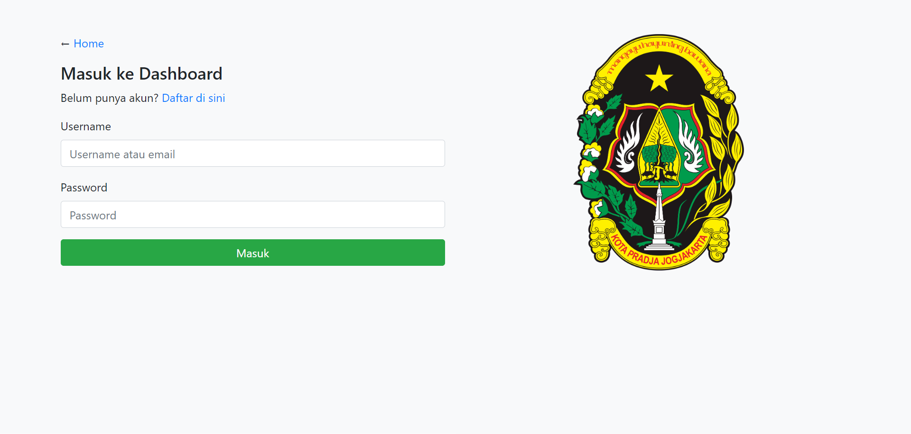

### Registrasi

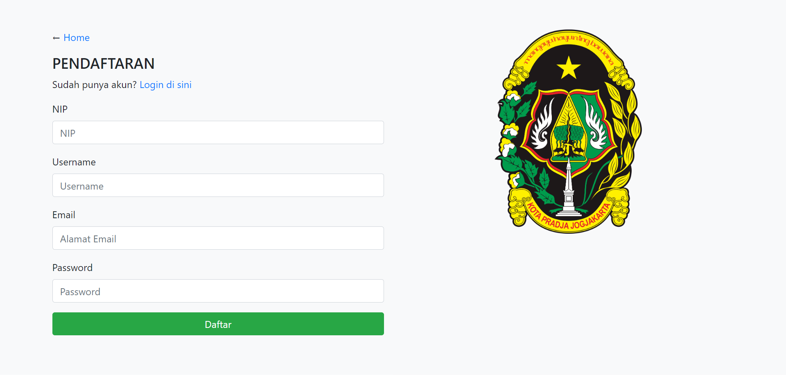

### Dashboard Petugas

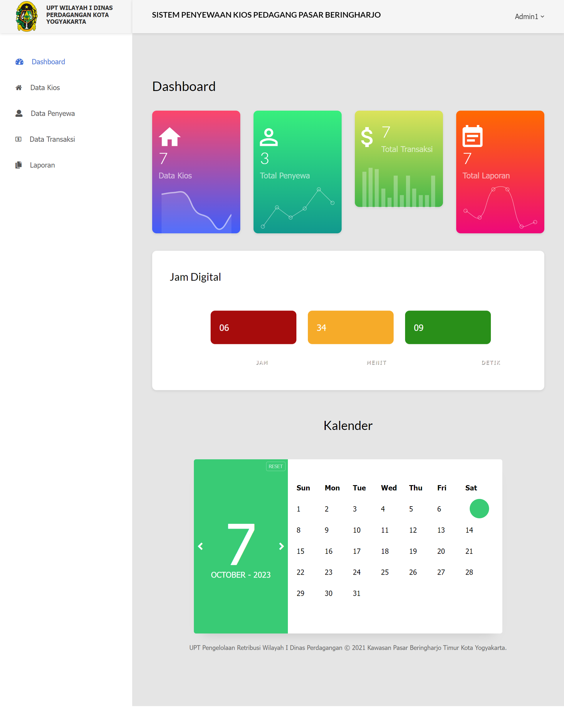

### Data Kios

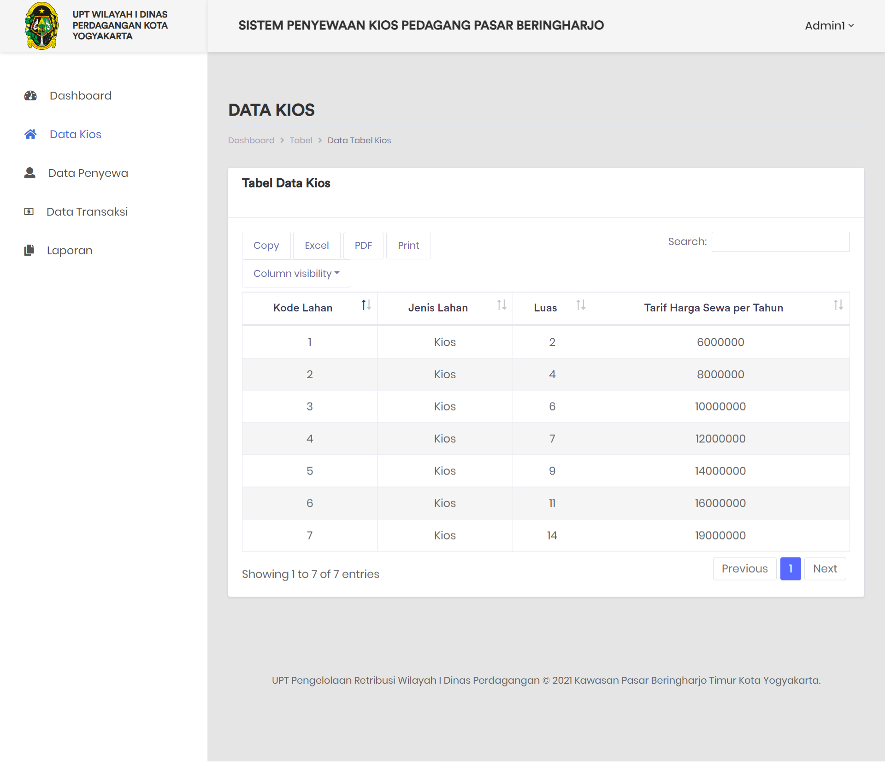

### Data Pedagang Penyewa Kios

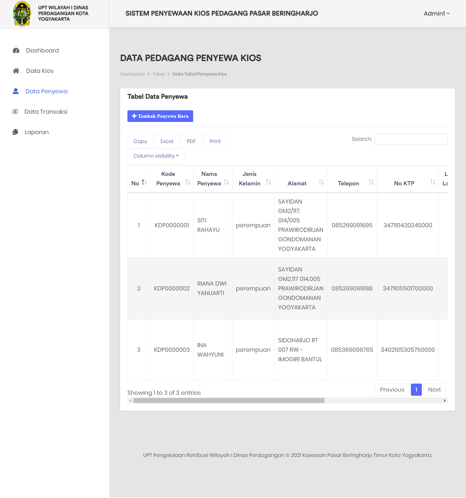

### Tambah Data Penyewa Kios

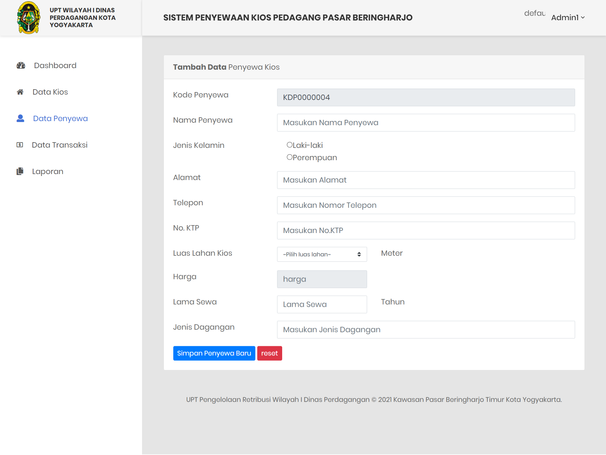

### Data Transaksi

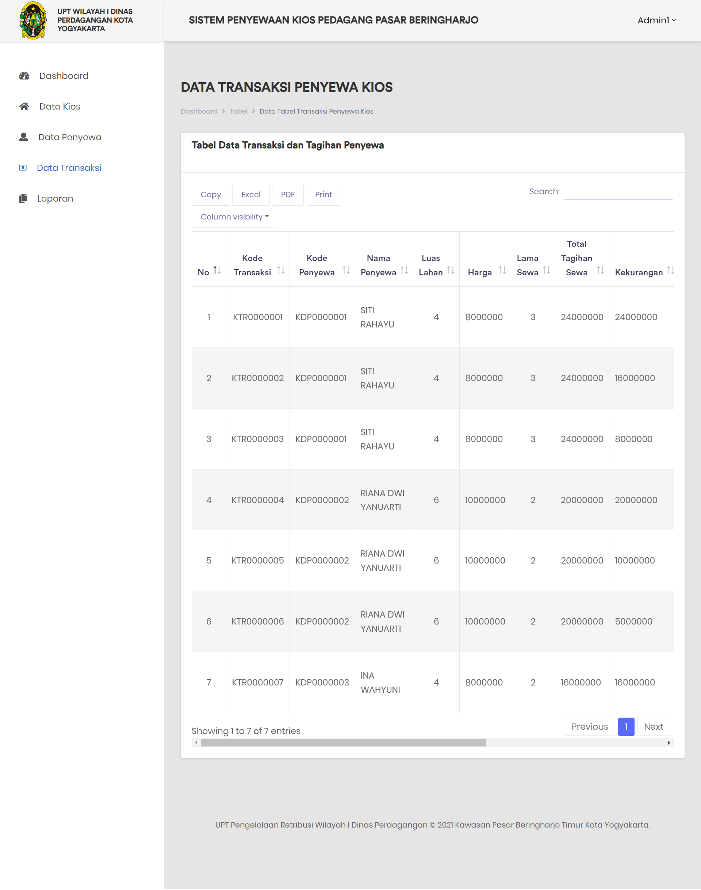

### Laporan Perbulan

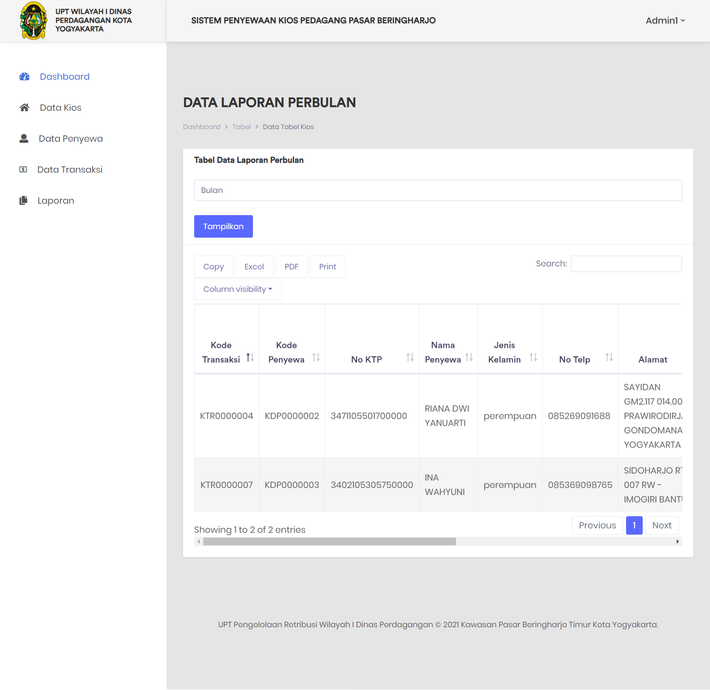

### Laporan Pertahun

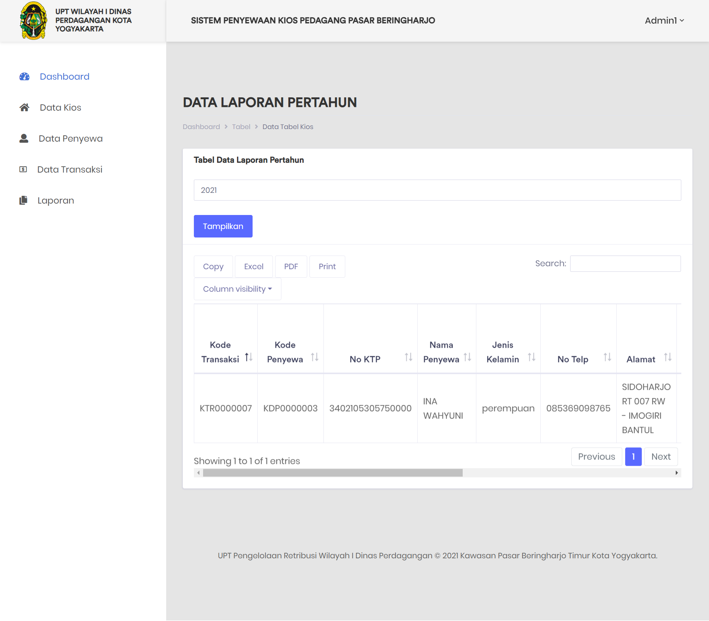

### Profile

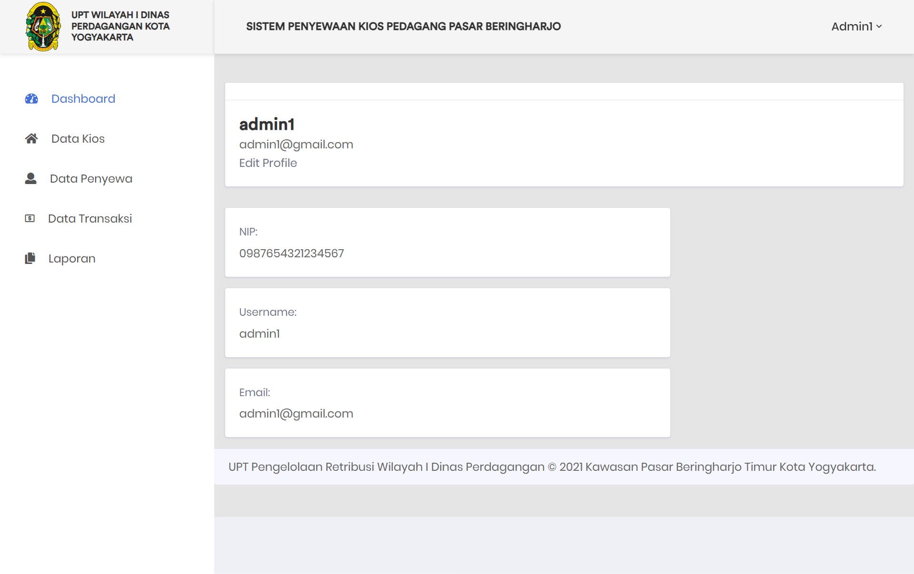

### Dashboard Kepala UPT

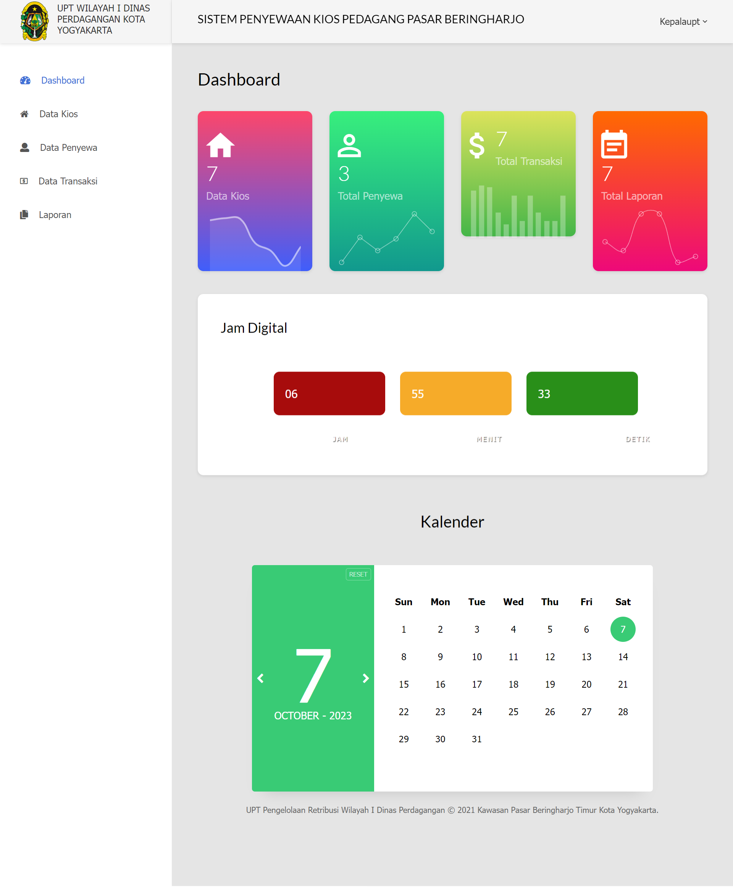
